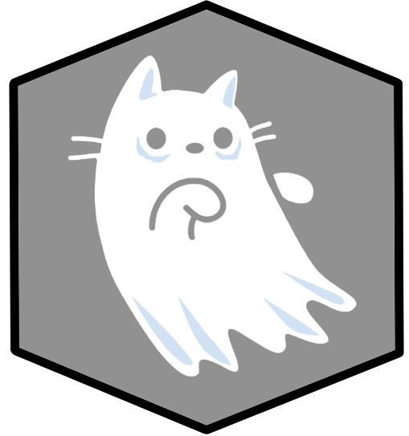

<h1 align="center">
   
  
   
  NCoder0
   
</h1>

<h4 align="center">A minimal Markdown Editor desktop app built on top of <a href="http://electron.atom.io" target="_blank">Electron</a>.</h4>

  <a href="#key-features">Key Features</a> •
  <a href="#how-to-use">How To Use</a> •
  <a href="#download">Download</a> •
  <a href="#credits">Credits</a> •
  <a href="#related">Related</a> •
  <a href="#license">License</a>

<h1 align="center">
</a>
</h1>

## Key Features

## How To Use

## Download

## Emailware

## Credits

This software uses the following open source packages:

- [Android](https://www.android.com/)
- [IOS](https://www.apple.com/ios/ios-16/)

## Related

## Support

## You may also like...

## License

---

> GitHub [@NCoder0](https://github.com/NCoder0) &nbsp;&middot;&nbsp;

